# Manual segmentation of microtissue on the SCC

## Table of contents

* [Background and Summary](#summary)
* [Connecting to the SCC](#scc)
* [Package installation instructions](#install)
* [Manual segmentation](#segmentation)

## Background and Summary <a name="summary"></a>

In our experimental wound healing project, our collaborators seed microtissues onto 4 pillars (microposts), then they pulse a laser through the middle of the microtissues to injure them. The microtissues contract and deposit provisional matrices to heal over time. Our goal for the automated software is to extract the tissue masks, the pillars, and the wounds. Critically, we must validate to ensure the code is working as intended by comparing the automated segmentation results to the manual segmentation. Here, we provide the tutorials to manually segment the region of interests in our experiment via the napari package.

## Connecting to the SCC <a name="scc"></a>

The [Shared Computing Cluster](https://www.bu.edu/tech/support/research/computing-resources/scc/) (SCC) is a cluster of computers that we can use to run codes. For this tutorials, you will only need to understand how to start the SCC. First, go to https://scc-ondemand1.bu.edu. Then, you can select the ``Interactive Apps`` drop down located on top, then select ``Desktop``. This will lead you to the following screen:

<p align = "center">
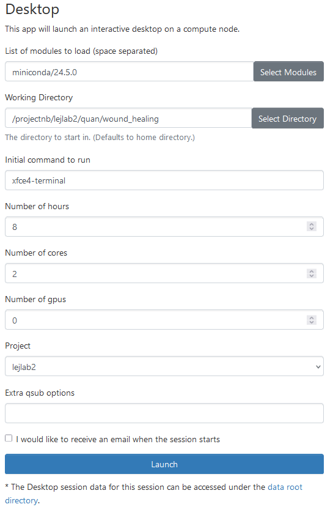

After you have filled out all the information accordingly, you can click ``Launch``. Note that your entries might not be exactly like mine.

## Package installation instructions <a name="install"></a>

Once you've connected to the SCC desktop interactive session, you should see the screen below, with a [command-line interface](https://en.wikipedia.org/wiki/Command-line_interface) terminal.

<p align = "center">
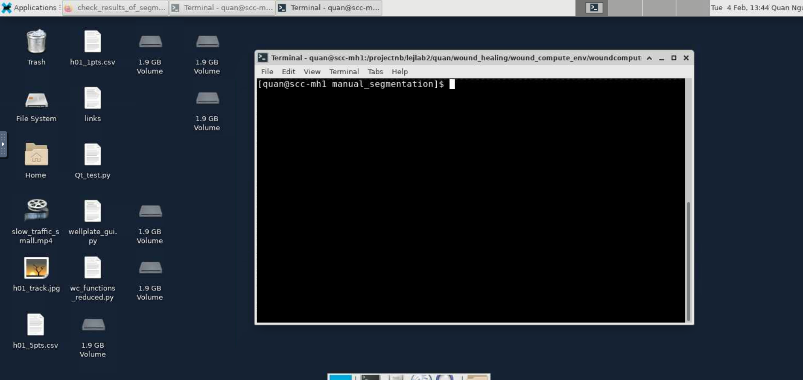

Here, you can input different commands to interact with the computer. We need to setup a working [Conda environment](https://docs.conda.io/projects/conda/en/latest/user-guide/getting-started.html) before we can use our codes.

1. Use the ``cd`` command to direct yourself to a folder you wish to download our WoundCompute package in. For example, if you wish to download in ``/projectnb/lejlab2/quan/example``, you can enter the following command:
```bash
cd /projectnb/lejlab2/quan/example
```
2. Clone a copy of our WoundCompute software:
```bash
git clone https://github.com/elejeune11/woundcompute.git
```
3. Type in the terminal to create a virtual environment with conda (using ``mamba`` in place of ``conda`` also works and will be faster):
```bash
conda create --name manual_segmentation python=3.9.13
```
4. Type in the terminal to activate your virtual environment:
```bash
conda activate manual_segmentation
```
5. Check to make sure that the correct version of python is running (should be ``3.9.13``)
```bash
python --version
```
6. Update some base modules (just in case)
```bash
pip install --upgrade pip setuptools wheel
```
7. Navigate to the folder in WoundCompute with the ``pyproject.toml``. Type the command ``ls`` and make sure that the file ``pyproject.toml`` is in the current directory.
8. Now, create an editable install of WoundCompute:
```bash
pip install -e .
```
9. One of the required package inside WoundCompute is ``opencv-python``. This package is not compatible with our main package use for manual segmentation (``napari``). We need to uninstall it:
```bash
pip uninstall opencv-python
```
10. Then, we will install a version that is compatible with ``napari``:
```bash
pip install opencv-python-headless==4.6.0.66
```
11. Finally, we need to install [napari](https://napari.org/stable/) for visualization and manual segmentation:
```bash
conda install -c conda-forge napari pyqt
```
12. If you would like to see all the packages that have been install, you can type ``conda list``.

## Manual segmentation <a name="install"></a>

With all the packages install, we can now move on to manually segmenting the tissue mask, pillars mask, and wound mask.

### Reminder before running segmentation code
1. Make sure you're in the correct folder with the necessary code ``manual_segmentation.py`` and data (you can check with me before getting started). Type ``ls`` to get check folder contents.
2. If you haven't activated an environment, do so with:
```bash
conda activate manual_segmentation
```

### Segmentation
1. You can start the code with:
```bash
python manual_segmentation.py
```
2. You will be prompted to enter a number for the dataset. Select the number corresponding with the dataset you're working on.
<p align = "center">
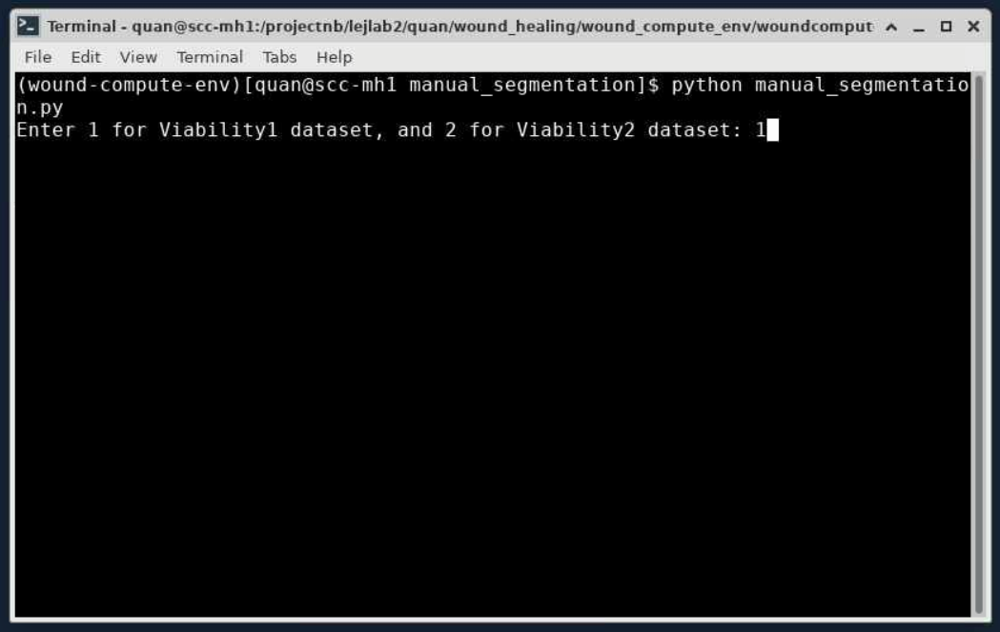
  
4. The terminal will display a list of folders, with the indexing to the left. You can now enter a number corresponding to the sample you want to segment. For example, to work on sample ``.../s002_A01``, you can enter the number 1.
<p align = "center">
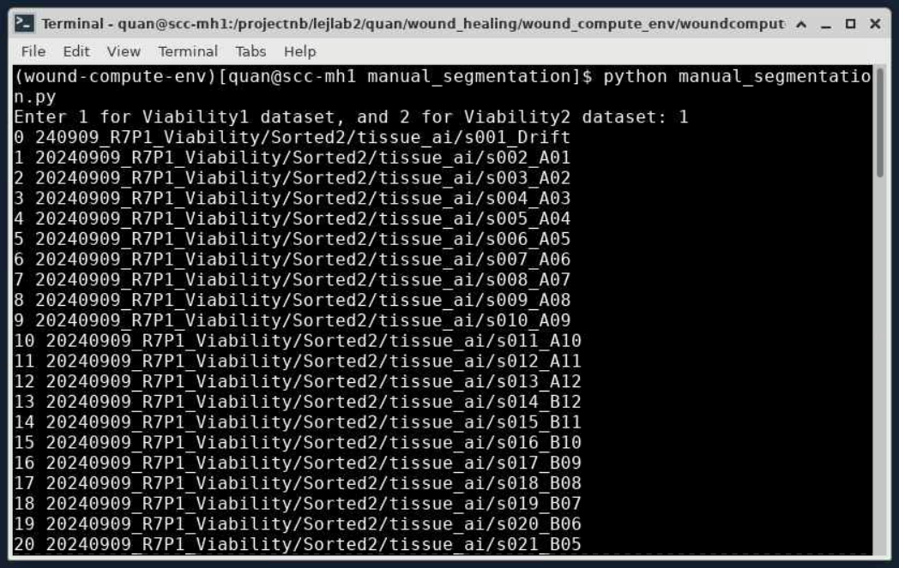
<p align = "center">
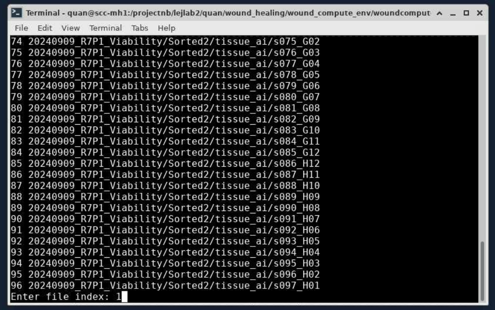
  
5. Now a napari screen will pop up with the selected sample. You can click on the label option to start segmenting.
<p align = "center">
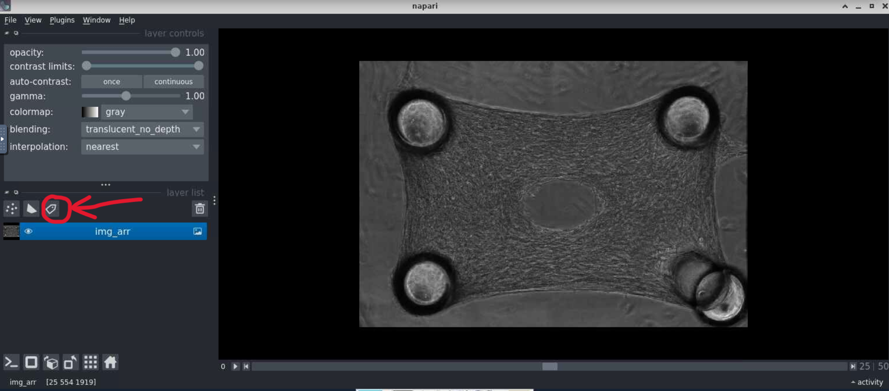
  
6. Here, you can select the Pan/Zoom option on the top to move (aka pan) the image around with your mouse, or zoom with your scroll wheel. You can also slide the slider on the bottom to switch between frames.
<p align = "center">
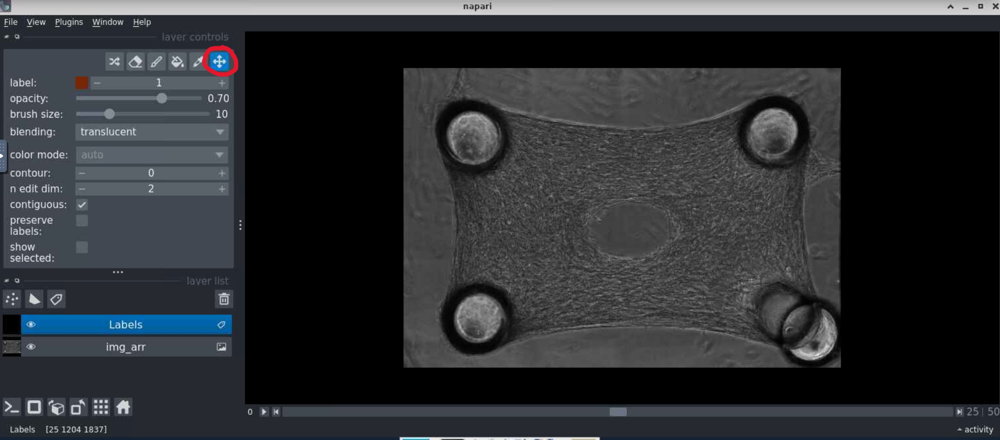
  
7. To segment the tissue mask, select the paint brush tool. Make sure ``label`` is set to 1 for tissue mask. Now you can outline the microtissue.
<p align = "center">
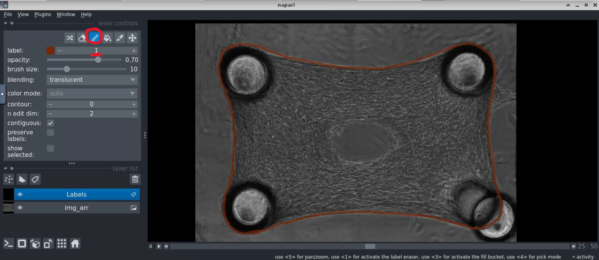
  
8. To complete the tissue segmentation, select the fill bucket tool to fill in the outline. Make sure ``label`` is set to 1 for tissue mask.
<p align = "center">
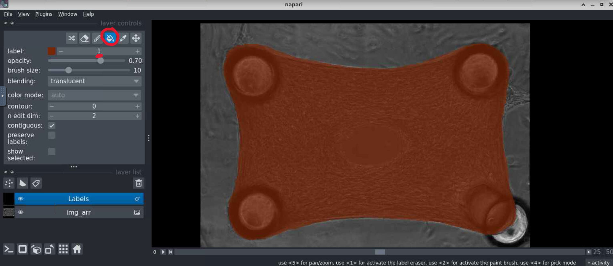
  
9. Similarly, using a combination of the paint brush tool and the fill bucket tool, we can segment both the pillars and the wound. For pillars, set the ``label`` to 2. For the wound, set the ``label`` to 3. **Note**: you can change the opacity of the label layer to see the microtissue and pillars clearer.
<p align = "center">
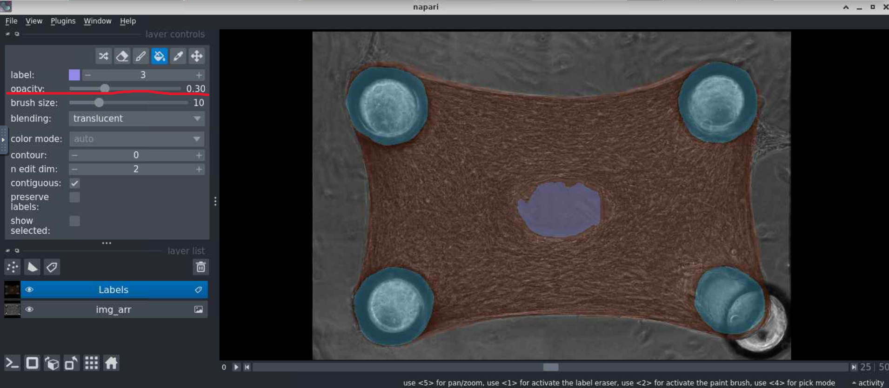
  
10. For each sample, repeat steps 7 through 9 for every five frames (i.e., frame 0, frame 4, frame 9, frame 14, etc.)
11. After segmentation is completed, you can X out of napari. You should received a message indicating that your work is saved.
<p align = "center">
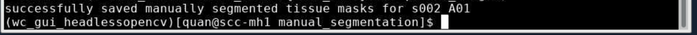
